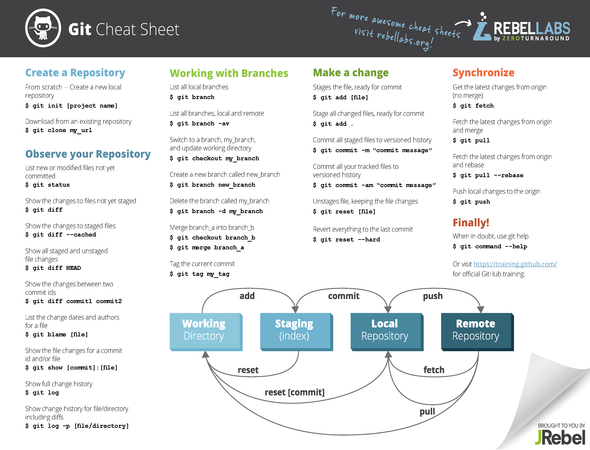

# Progetto Ingegneria del Software

## Scadenze:

				HTML
				
					
				
				
						
				
			
☑ Definizione dei gruppi di lavoro – 4/5 studenti21/09/2020
☑ Proposta iniziale 29/9/2020
☑ Piano di Progetto 18/10/2020
☑ Documento di analisi e specifica 02/11/2020
☑ Piano di testing 19/11/2020
☐ Documento di Progettazione 14/12/2020
☐ Codice e messa in linea del sistema ??/01/2021

## Slide & Guide:

<ul>

## Git cheat sheet:

 

## Link utili:

<ul>
<li><a href="https://www.swebok.org/">SE Body of Knowledge</a></li>
<li><a href="https://standards.ieee.org/">Standard IEEE del software</a></li>
<li><a href="https://www.w3c.org/">Standard del Web</a></li>
<li><a href="https://www.omg.org/">Standard del software a oggetti</a></li>
<li><a href="https://www.oasis-open.org/">Standard del SW business</a></li>
<li><a href="https://www.computerhistory.org/timeline/">Timeline of computer history</a></li>